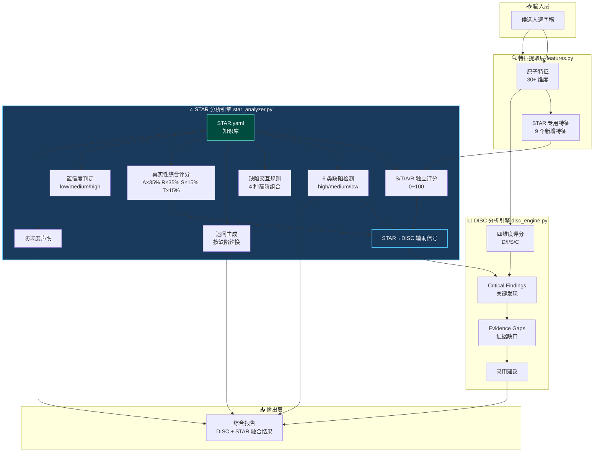
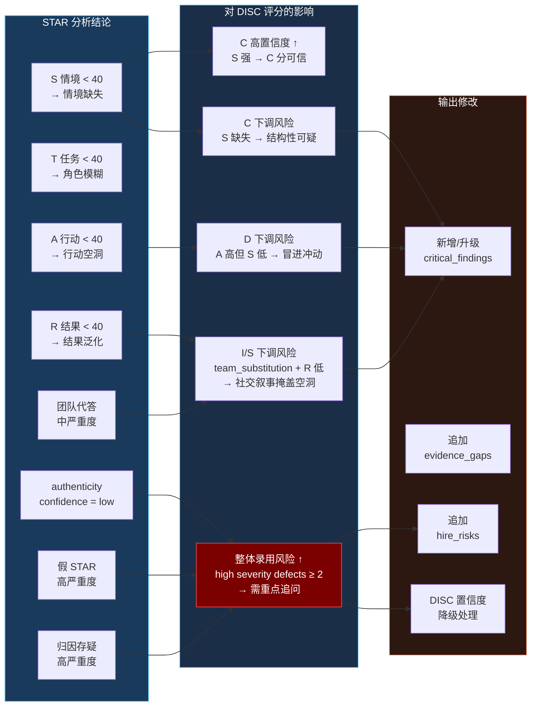
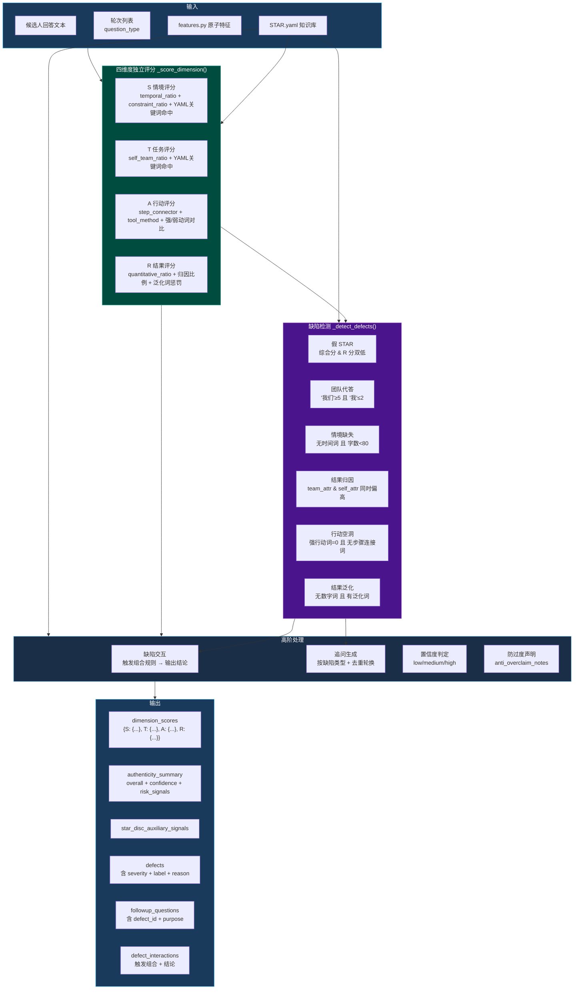

# STAR 分析：有 STAR.yaml 知识库 vs 无 STAR.yaml 的对比

> 本文档记录 STAR 分析引擎在引入 `knowledge/STAR.yaml` 知识库前后的能力差异。

---

## 一、能力对比总表

| 评估维度 | 无 STAR.yaml（仅 features.py 关键词计数） | 有 STAR.yaml（完整 STAR 分析引擎） | 提升说明 |
|---|---|---|---|
| **S/T/A/R 独立评分** | ❌ 无。只有一个 0~1 的 `star_structure_score`，代表"覆盖了几个关键词桶" | ✅ 四维度各自分数（0~100），独立评分 | 从粗糙覆盖率到完整结构诊断 |
| **评分依据** | 固定 4 个桶 × 约 17 个词，无权重区分 | 强/弱关键词独立统计 + 句法加分 + 反线索惩罚 + YAML 命中加权 | 从"有没有"到"有多好" |
| **缺陷检测类型** | ❌ 无缺陷检测 | ✅ 检测 6 类：假 STAR、团队代答、情境缺失、结果归因、行动空洞、结果泛化 | 从 0 到完整的质量评估体系 |
| **缺陷严重度** | ❌ 无 | ✅ high / medium / low 三级，并按严重度排序 | 可区分风险优先级 |
| **缺陷交互规则** | ❌ 无 | ✅ 4 种高阶组合触发规则（如 fake_star + result_attribution_error → 高风险） | 发现单一缺陷无法捕捉的组合风险 |
| **追问生成** | ❌ 无 | ✅ 每种缺陷 5 条，按轮次轮换、去重 | 从无法追问到完整追问体系 |
| **真实性综合评分** | ❌ 无 | ✅ A 35% + R 35% + S 15% + T 15% 加权（与 STAR.yaml 一致） | 从无到有，可量化回答质量 |
| **置信度判定** | ⚠️ 借用 DISC 的 confidence_level，与 STAR 逻辑无关 | ✅ 独立 low/medium/high，与 STAR.yaml confidence_rules 一致 | 判定结果的可信程度 |
| **防过度声明** | ❌ 无 | ✅ 输出 `anti_overclaim_notes`（YAML原文），提示面试官避免误读 | 防止高分低能误判 |
| **STAR→DISC 辅助信号** | ❌ 无。STAR 仅作为 DISC 的辅助输入，但实际无辅助 | ✅ S/T/A/R 分数直接影响 DISC critical findings，降低高 STAR-R + 低 S 场景下 D 置信度等 | 从"名字叫辅助"到"真正辅助" |
| **特征覆盖率** | 仅 17 个词分 4 桶 | 9 个 STAR.yaml [待实现] 特征全部补全 + 6 个内部辅助特征 | 特征数量从 ~17 词到 ~120+ 词 + 多维度统计 |
| **量化指标检测** | ❌ 无 | ✅ `quantitative_words_ratio`、`vague_result_words_ratio` | 区分"提升了3倍"和"效果不错" |
| **时间/约束检测** | ⚠️ 简单包含"当时"等 | ✅ `temporal_words_ratio`、`constraint_words_ratio`、`context_marker_density` | 区分"有背景"和"背景具体" |
| **步骤结构检测** | ❌ 无 | ✅ `step_connector_ratio` | 判断回答是否有过程有步骤 |
| **工具/方法检测** | ❌ 无 | ✅ `tool_method_words_ratio` | 判断行动是否具体可验证 |
| **团队/个人区分** | ⚠️ 仅 `self_vs_team_orientation`（布尔值） | ✅ `_self_team_ratio`（数值比值）+ `team_result_attribution_ratio`（归因比例） | 从二元判断到比例评估 |
| **结果归因检测** | ❌ 无 | ✅ `result_attribution_self_ratio`、`team_result_attribution_ratio` | 区分"我的功劳"和"团队的功劳" |
| **知识库可维护性** | ❌ 无。关键词硬编码在 features.py | ✅ 知识库独立为 YAML，随时可增删关键词/规则/追问 | 从代码耦合到知识驱动 |
| **前端展示标签** | ⚠️ 只有 `star_structure_score` 一个数字 | ✅ 缺陷带中文标签（S/T/A/R 带 band 描述）、追问独立输出、风险信号列表 | 从数字到可读报告 |
| **CHANGELOG 记录** | ❌ 无 | ✅ `CHANGELOG_PERSONALITY.md` 完整记录实现过程和排查路径 | 可追溯、可维护 |

---

## 二、关键差异示例

### 示例：同一段回答的评分对比

> 候选人回答："当时我们项目遇到了问题，我优化了一下，效果还不错。"

#### 无 STAR.yaml

| 输出字段 | 值 | 说明 |
|---|---|---|
| `star_structure_score` | `0.50` | 4 个桶中命中了 2 个（situation=1, result=1），50% |
| `star_hits` | `{"situation": 1, "task": 0, "action": 0, "result": 1}` | 勉强有情境和结果 |
| 缺陷 | 无 | 系统不知道这段回答质量差 |
| 追问 | 无 | 无法生成追问 |

#### 有 STAR.yaml

| 输出字段 | 值 | 说明 |
|---|---|---|
| `dimension_scores.S` | ~50 | 有"当时"，但无约束条件 |
| `dimension_scores.T` | ~20 | 全程无"我的职责/目标"，"我优化"也非角色声明 |
| `dimension_scores.A` | ~25 | "优化"是弱关键词，无宾语，step_connector=0 |
| `dimension_scores.R` | ~20 | "效果不错"是泛化词，无数字 |
| `overall_score` | ~30 | 综合质量差 |
| `defects` | `fake_star(high)`, `action_vague(high)`, `result_abstract(high)` | 三高缺陷，真实性极低 |
| `followup_questions` | "你说的「优化了」，具体优化了什么？原来是什么状态，推进后又是什么状态？" | 精准追问空洞行动 |
| `star_disc_auxiliary_signals` | "A 维度过高但 S 维度极低，D 特征置信度需下调" | 提示 DISC 不要过度相信这段回答 |

---

## 三、STAR 分析在 DISC 工作流中的位置

### 3.1 整体工作流（STAR 作为 DISC 的结构验证层）

**流程说明：**
- `star_stage` 必须在 `disc_evidence_stage` 之前执行，因为 DISC 引擎需要读取 `star_result`
- STAR 输出的 **STAR→DISC 辅助信号** 会修改 `critical_findings` 的严重度和 `evidence_gaps` 的内容
- 防过度声明（`anti_claim_notes`）直接透传到最终报告，提醒面试官避免误读

---

### 3.2 STAR→DISC 辅助信号的交叉影响

---

### 3.3 STAR 引擎内部评分流程

---

### 3.4 关键文件对应关系

| 步骤 | 源文件 | 输出字段 | 消费方 |
|---|---|---|---|
| 特征提取 | `app/features.py` | `star_s_score` / `temporal_words_ratio` 等 | `app/star_analyzer.py` |
| STAR 评分 | `app/star_analyzer.py` | `dimension_scores.S/T/A/R` | `app/disc_engine.py` |
| STAR 缺陷 | `app/star_analyzer.py` | `defects` / `authenticity_summary` | `app/disc_engine.py` |
| STAR→DISC | `app/star_analyzer.py` | `star_disc_auxiliary_signals` | `app/disc_engine.py` |
| DISC 融合 | `app/disc_engine.py` | `critical_findings` / `evidence_gaps` | `workflow/engine.py` |
| 最终输出 | `workflow/engine.py` | `star_analysis` + `disc_analysis` | API / 前端 |

---

## 四、知识点睛

- **无 STAR.yaml 的 STAR 分析**：本质是一个"关键词有没有出现"的覆盖率指标，与真正的行为面试 STAR 评分体系（情境→任务→行动→结果 四个独立维度）完全不同。
- **有 STAR.yaml 的 STAR 分析**：完全基于 STAR.yaml 知识库驱动，代码只是执行规则引擎，关键词、追问模板、缺陷定义、置信度规则全部由 YAML 维护，无需改代码即可迭代。
